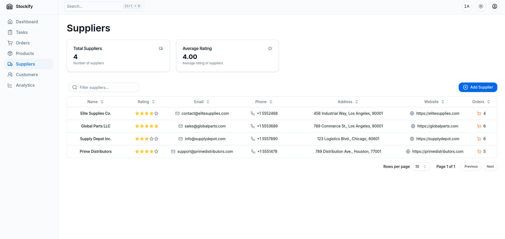

<h1 align="center">
  <br />
  
  <br />
  Stockify
  <br />
</h1>

<h4 align="center">A warehouse management system designed to simplify inventory management for warehouse workers.</h4>

<p align="center"><em>Note: The application supports both light and dark modes, enhancing user experience.</em></p>

## Features

### 1. **Dashboard**

- Real-time updates on key warehouse metrics.
- Track inventory value, low-stock products, shipped orders, and total products in stock.
- View recent actions like order creation and stock updates.


### 2. **Tasks**

- Manage warehouse operations with task IDs, labels, and priority levels.
- AI-powered task generation using [Ollama](https://github.com/ollama/ollama-js).
- Create, edit, delete, filter, and search tasks.


### 3. **Orders**

- Place new orders for new products.
- Place restock orders for products already in inventory.
- View order status, receipts, and the total number of orders placed in the current month and week.


### 4. **Products**

- Filter and sort products by category or status (In Stock, Out of Stock, Archived).
- Edit existing product information or archive products from the inventory.
- Export products to a CSV file for easy storage and analysis.


### 5. **Suppliers**

- Manage supplier information and track performance.
- Add, filter, search, and rate suppliers.
- View supplier profiles with contact details and order history.
- Monitor overall supplier metrics and individual ratings.



### 6. **Customers**

- Manage customer information and track their shipments.
- Add new customers with detailed contact information.
- View customer profiles including personal details and shipment history.
- Create and manage shipments for customers.
- Filter, sort, and search customers for easy access to information.


### 7. **Analytics**

- Visual charts and graphs provide insightful inventory data:

  - **Product Categories:** A pie chart showing the distribution of products by category.
  - **Monthly Inventory Value:** A line chart illustrating the inventory value trend over time.
  - **Top 5 Highest Value Products:** A bar chart highlighting the top 5 products by total value.


### 8. **Settings**

- Manage account settings, including adding or updating account information.


### 9. **Sign Up / Log In**

- **User Authentication:** Users can easily create an account or log in to access the dashboard. The signup and login forms are designed to be user-friendly, ensuring a smooth onboarding experience.


## Tech Stack

Stockify is built using modern and efficient web technologies:

**Front-end:**

- [TypeScript](https://www.typescriptlang.org/) for type safety and code quality.
- [React](https://reactjs.org/) for building user interfaces.
- [Tailwind CSS](https://tailwindcss.com/) for utility-first styling.
- [Shadcn/ui](https://ui.shadcn.com/) for pre-built, customizable UI components.
- [React Router](https://reactrouter.com/) for routing.
- [Tanstack Query](https://tanstack.com/query/latest) for efficient data fetching.
- [React Hook Form](https://react-hook-form.com/) for efficient form management.

**Back-end:**

- [Express](https://expressjs.com/) for handling backend logic.
- [jsonwebtoken](https://github.com/auth0/node-jsonwebtoken) for JWT authentication.
- [Multer](https://github.com/expressjs/multer) for file uploads.

**Database:**

- [Prisma](https://www.prisma.io/) as the database ORM.

**Other Libraries:**

- [Axios](https://github.com/axios/axios) for HTTP requests.
- [Zod](https://zod.dev/) for schema validation.
- [date-fns](https://date-fns.org/) for date manipulation.
- [Recharts](https://recharts.org/en-US/) for visual data representation.
- [React Day Picker](https://react-day-picker.js.org/) for date selection in forms.
- [React CSV](https://github.com/react-csv/react-csv) for exporting data to CSV files.
- [Node Cron](https://github.com/merencia/node-cron) for scheduling tasks.
- [Papaparse](https://github.com/mholt/papaparse) for parsing CSV files.
- [Ollama](https://github.com/ollama/ollama-js) for AI integration.

## API Reference

Read about the API reference [here](./docs/api-reference.md).

## Getting Started

### Prerequisites

Ensure you have the following installed:

- [Git](https://git-scm.com/)
- [Node.js (v22+)](https://nodejs.org/en/)
- [Ollama](https://ollama.com/download) with the following model: [qwen2.5-coder:1.5b](https://ollama.com/library/qwen2.5-coder:1.5b)

### Installation

1. **Clone the repository**:

   ```bash
   git clone https://github.com/lucchesilorenzo/stockify-react-express
   cd stockify-react-express
   code .
   ```

2. **Install dependencies**:

   ```bash
   npm install && npm run install-all
   ```

3. **Set up environment variables**:

   ```bash
   cd frontend
   ```

   Create a `.env` file for the **front-end** with the following values:

   ```bash
   VITE_BASE_URL=http://localhost:3000 # The URL of your Express app
   ```

   ```bash
   cd ../backend
   ```

   Create a `.env` file for the **back-end** with the following values:

   ```bash
   DATABASE_URL="file:./dev.db"
   APP_ORIGIN=http://localhost:5173 # The URL of your React app
   API_URL=http://localhost:3000 # The URL of your Express app
   PORT=3000 # The port your Express app is running on
   NODE_ENV=development # Set to "production" in a production environment
   JWT_SECRET="your-secret" # You can generate one with `openssl rand -base64 32`
   ```

4. **Run database push**:

   ```bash
   npx prisma db push
   ```

5. **Run database seed**:

   ```bash
   npx prisma db seed
   ```

6. **Start both the frontend and backend**:

   ```bash
   cd .. && npm start
   ```

   The front-end will be running at [http://localhost:5173](http://localhost:5173).

## Database Schema

Here’s a basic overview of the core models:


## Future Features

- **Notification System**: Implement a notification system to notify users about important events, such as low stock alerts.
- **User Roles and Permissions**: Add user roles and permissions to control access to specific features.

For the original Next.js-based implementation, see [Stockify on Next.js](https://github.com/lucchesilorenzo/stockify).

## License

This project is licensed under the MIT License. See the [LICENSE](./LICENSE) file for more details.
